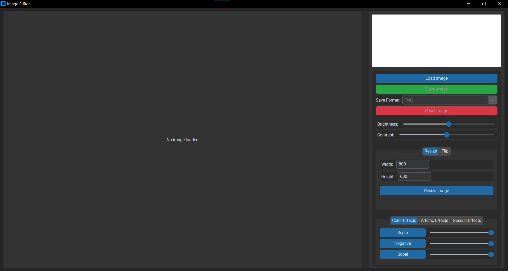

# ✨Image Editor Application✨

[](https://www.python.org/)

A user-friendly desktop application for applying various effects and adjustments to images, built with Python, CustomTkinter, OpenCV, and Matplotlib.

---

## 🌟 Key Features

*   **Load & Save:** Supports common image formats (PNG, JPEG, BMP, etc. via OpenCV).
*   **Visual Effects:** Apply artistic and corrective filters:
    *   *Color:* Sepia, Negative, Sobel
    *   *Artistic:* Box Blur, Sharpening, Edge Sketch
    *   *Special:* HDR, Vignette, Laplacian
*    sliders for fine-tuning effect strength.
*   **Adjustments:** Control Brightness & Contrast with real-time preview.
*   **Manipulation:** Resize and Flip (Horizontal/Vertical) images.
*   **Histogram:** View dynamic R, G, B channel histograms.
*   **Reset:** Easily revert to the original image.
*   **Modern UI:** Sleek interface using CustomTkinter, adapting to system themes.

---

## 📸 Screenshots

Screenshot of the UI

| Main Interface                  |  
| :-----------------------------: |
|     | 


## ⚙️ Installation

1.  **Clone the Repository:**
    ```bash
    git clone <your-repository-url>
    cd <repository-directory>
    ```
---

## ▶️ How to Use

1.  **Run the Application:**
    ```bash
    python main.py
    ```
2.  **Load Image:** Click `Load Image` and select your file.
3.  **Edit:**
    *   Use sliders for **Brightness/Contrast**.
    *   Select **Effects** tabs, click an effect, and adjust its intensity slider.
    *   Use **Manipulation** tabs for resizing or flipping.
    *   Observe the **Histogram** update.
4.  **Save:** Choose a format (PNG, JPEG, BMP), click `Save Image`, and select a destination.
5.  **Reset:** Click `Reset Image` to undo all changes.

---

## 📋 Requirements

| Library         | Purpose                                                                 |
|----------------|-------------------------------------------------------------------------|
| `customtkinter`| Modern and customizable alternative to standard `tkinter` for GUI design|
| `tkinter`      | Standard GUI toolkit included with Python                              |
| `Pillow`       | Image processing (resizing, format conversion, etc.)                   |
| `numpy`        | Numerical computing, used for matrix operations                        |
| `opencv-python`| Computer vision library for image processing and effects              |
| `matplotlib`   | Plotting histograms and visual elements within the GUI                 |

---

## 📦 Installation Instructions

You can install all necessary dependencies with the following command:

```bash
pip install customtkinter pillow numpy opencv-python matplotlib
````

# 📌 Project Dependencies

This document lists all required Python libraries for running the **Image Editor Application** built with `customtkinter`, `OpenCV`, and other image-processing utilities.

---

> 💡 `tkinter` is part of the standard Python distribution. If not available, install it via your OS package manager:
>
> * **Windows**: Included by default
> * **Ubuntu/Debian**: `sudo apt install python3-tk`
> * **macOS**: Included by default with Python
